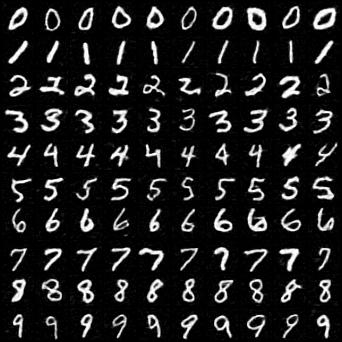
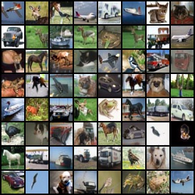
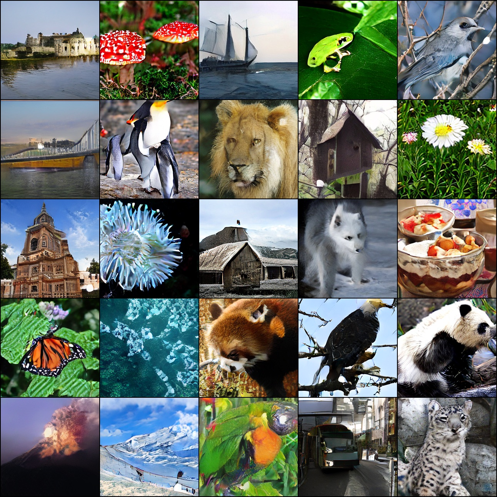
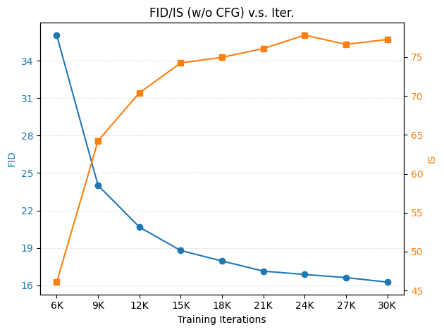
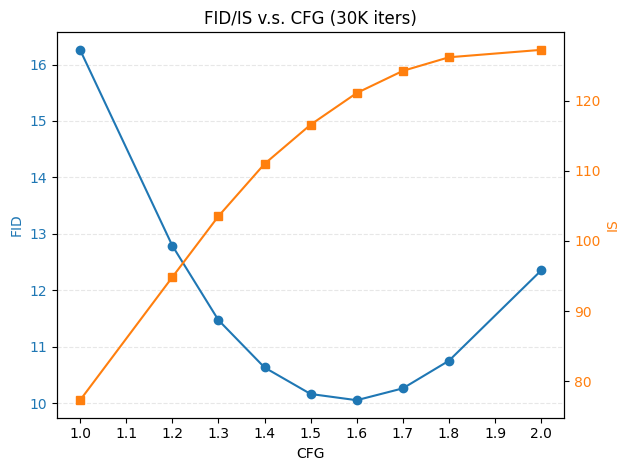

# Drifting Models

Unofficial PyTorch implementation of ["Generative Modeling via Drifting"](http://arxiv.org/abs/2602.04770).
The official JAX implementation can be found at [lambertae/drifting](https://github.com/lambertae/drifting).

<p align="center">



</p>

## Setup

The code is tested with Python 3.12 and PyTorch 2.6.0 on 4090/A6000/A100 GPUs. Other setups may also work.

```shell
# clone the repo
git clone https://github.com/xyfJASON/drifting-models-pytorch.git
cd drifting-models-pytorch

# create conda environment
conda create -n drift python=3.12 -y
conda activate drift

# install dependencies
pip install torch==2.6.0 torchvision==0.21.0 --index-url https://download.pytorch.org/whl/cu126
pip install -r requirements.txt
```

## Configs

<table>
<tr>
    <th align="left">Dataset</th>
    <th align="left">Res.</th>
    <th align="left">Cond.</th>
    <th align="left">AE</th>
    <th align="left">Encoder</th>
    <th align="left">Network</th>
    <th align="left">Config.</th>
</tr>
<tr>
    <td rowspan="2">MNIST</td>
    <td rowspan="2">32×32</td>
    <td>-</td>
    <td>-</td>
    <td>-</td>
    <td>UNet (8.2M)</td>
    <td><a href="./configs/mnist-unc-pixel-noenc-unet.yaml">config</a></td>
</tr>
<tr>
    <td>class</td>
    <td>-</td>
    <td>-</td>
    <td>UNet (9.6M)</td>
    <td><a href="./configs/mnist-c2i-pixel-noenc-unet.yaml">config</a></td>
</tr>
<tr>
    <td rowspan="2">CIFAR-10</td>
    <td rowspan="2">32×32</td>
    <td>-</td>
    <td>-</td>
    <td>DINOv2</td>
    <td>UNet (32.9M)</td>
    <td><a href="./configs/cifar10-unc-pixel-dinov2-unet.yaml">config</a></td>
</tr>
<tr>
    <td>class</td>
    <td>-</td>
    <td>DINOv2</td>
    <td>UNet (38.4M)</td>
    <td><a href="./configs/cifar10-c2i-pixel-dinov2-unet.yaml">config</a></td>
</tr>
<tr>
    <td>ImageNet</td>
    <td>256×256</td>
    <td>class</td>
    <td>SDVAE</td>
    <td>Latent-MAE</td>
    <td>DiT-B/2 (132.5M)</td>
    <td><a href="./configs/imagenet-c2i-sdvae-latentmae-ditb2.yaml">config</a></td>
</tr>
</table>

## Preprocessing

Extract and save autoencoder latents. This is optional but can speed up training.

```shell
torchrun --nproc-per-node 8 preprocess.py --dataname DATANAME --dataroot DATAROOT --image-size IMAGESIZE --save-dir SAVEDIR [--autoencoder AUTOENCODER]
```

- `--dataname DATANAME`: name of the dataset, e.g., `imagenet`.
- `--dataroot DATAROOT`: root directory of the dataset.
- `--image-size IMAGESIZE`: image size, e.g., `256`.
- `--save-dir SAVEDIR`: directory to save the extracted latents, e.g., `./data/imagenet256-latents`.
- `--autoencoder AUTOENCODER`: autoencoder to use, e.g., `sdvae`.

## Training

```shell
# Unconditional Generation
torchrun --nproc-per-node 8 train_unc.py -c CONFIG [-e EXPDIR] [--bf16] [--use-latent-dataset]

# Class-to-Image Generation
torchrun --nproc-per-node 8 train_c2i.py -c CONFIG [-e EXPDIR] [--bf16] [--use-latent-dataset]
```

- `-c CONFIG`: path to the configuration file.
- `-e EXPDIR`: path to the experiment directory. Default: `./runs/exp-<timestamp>`.
- `--bf16`: use bf16 mixed-precision.
- `--use-latent-dataset`: use the preprocessed latent dataset for training.
- `USE_TORCH_COMPILE=1`: set this environment variable to enable `torch.compile`.

## Sampling

```shell
# Unconditional Generation
torchrun --nproc-per-node 8 sample_unc.py -c CONFIG -w WEIGHTS --save-dir SAVE_DIR --num-samples NUM_SAMPLES --bspp BSPP [--bf16] [--make-npz]

# Class-to-Image Generation
torchrun --nproc-per-node 8 sample_c2i.py -c CONFIG -w WEIGHTS --save-dir SAVE_DIR --num-samples NUM_SAMPLES --num-classes NUM_CLASSES --cfg-scale CFG_SCALE --bspp BSPP [--bf16] [--make-npz]
```

- `-c CONFIG`: path to the configuration file.
- `-w WEIGHTS`: path to the trained model weights.
- `--save-dir SAVE_DIR`: directory to save the generated samples.
- `--num-samples NUM_SAMPLES`: total number of samples to generate.
- `--num-classes NUM_CLASSES`: number of classes to generate (only for class-to-image generation).
- `--cfg-scale CFG_SCALE`: classifier-free guidance scale (only for class-to-image generation).
- `--bspp BSPP`: batch size per process.
- `--bf16`: use bf16 mixed-precision.
- `--make-npz`: save the generated samples in `.npz` format for ImageNet FID evaluation.

## FID Evaluation

`tools/fid_watch.py` automates the per-checkpoint FID/IS/KID curve. For each new
checkpoint under `<exp-dir>/ckpt/`, it samples `--num-samples` images on CPU
(no GPU contention with active training) and computes FID, IS, and KID against
the CIFAR-10 train set via [`torch-fidelity`](https://github.com/toshas/torch-fidelity).
Results are appended to `<exp-dir>/fid_curve.json`.

```shell
pip install torch-fidelity

# Single pass over all existing ckpts (no daemon)
python tools/fid_watch.py \
    --exp-dir runs/<your_exp> \
    --config configs/<your_config>.yaml \
    --num-samples 10000 --bspp 64 --once

# Daemon mode: keeps polling for new ckpts every 600s
python tools/fid_watch.py \
    --exp-dir runs/<your_exp> \
    --config configs/<your_config>.yaml \
    --num-samples 10000 --bspp 64 --poll-secs 600
```

The script is idempotent — past entries in `fid_curve.json` are skipped, and
partial sample directories are wiped and regenerated automatically.

## Fine-Tune Experiment (Sinkhorn on top of trained baseline)

To test whether Sinkhorn drifting still improves over a baseline that has
already converged, we provide two fine-tune configs that continue training
from a baseline checkpoint for an additional 5K iterations:

- `configs/cifar10-unc-split-baseline-finetune.yaml` — Arm A (control:
  continue with `plan_type=two-sided`).
- `configs/cifar10-unc-split-sinkhorn-finetune.yaml` — Arm B (treatment:
  switch to `plan_type=sinkhorn`).

The two yamls are byte-identical except for `plan_type`, so the comparison
is strictly single-variable.

```shell
BASELINE_CKPT=runs/<your_baseline_run>/ckpt/step0029999

# Arm A: continue baseline (control)
NCCL_P2P_DISABLE=1 NCCL_IB_DISABLE=1 \
torchrun --nproc-per-node 4 --master_port 29560 train_unc.py \
    -c configs/cifar10-unc-split-baseline-finetune.yaml \
    -e runs/finetune_armA_baseline_5k --bf16 \
    --resume $BASELINE_CKPT

# Arm B: switch to Sinkhorn (treatment), starting from the SAME ckpt
NCCL_P2P_DISABLE=1 NCCL_IB_DISABLE=1 \
torchrun --nproc-per-node 4 --master_port 29561 train_unc.py \
    -c configs/cifar10-unc-split-sinkhorn-finetune.yaml \
    -e runs/finetune_armB_sinkhorn_5k --bf16 \
    --resume $BASELINE_CKPT
```

Each fine-tune saves a checkpoint and a 64-image sample grid every 1K steps
(`save_freq: 1000`, `sample_freq: 1000`), giving 5 evaluation points per arm
that can be fed into `tools/fid_watch.py` for a fine-grained FID curve.

## τ Screening Sweep

Before committing 30-50h to a full 30K run, use `tools/sweep_tau_run.sh` to
compare (`plan_type`, `eps`) cells at 5K iters with `warmup_steps=500`. Each
screening run takes ~6-8h on 4× 48GB GPUs at B=2048 bf16 and emits one row
into `runs/sweep_results.csv` so all servers can append to the same table.

```shell
pip install torch-fidelity   # one-time

# Sinkhorn at tau=0.05, 4-GPU bf16
bash tools/sweep_tau_run.sh --tau 0.05 --plan sinkhorn --gpus 4 --port 29600

# Two-sided baseline at the same tau (must match for apples-to-apples)
bash tools/sweep_tau_run.sh --tau 0.05 --plan two-sided --gpus 4 --port 29601

# T-ablation: same tau and plan, different sinkhorn_iters
bash tools/sweep_tau_run.sh --tau 0.05 --plan sinkhorn --T 5  --port 29602
bash tools/sweep_tau_run.sh --tau 0.05 --plan sinkhorn --T 50 --port 29603
```

Each run writes its checkpoint and 64-image sample grid to
`runs/screen_<plan>_tau<TAU>_b<B>_<precision>/`, computes FID/IS/KID once via
`tools/fid_watch.py --once`, and appends a row to `runs/sweep_results.csv`:

```text
run_name,plan,tau,T,batch,precision,steps,fid,is_mean,kid_mean,exp_dir
screen_sinkhorn_tau0p05_b2048_bf16,sinkhorn,0.05,20,2048,bf16,5000,42.31,8.94,...
screen_two-sided_tau0p05_b2048_bf16,two-sided,0.05,20,2048,bf16,5000,168.7,4.02,...
```

Pick the τ where the **sinkhorn-vs-baseline FID gap is largest** (not the τ
with the lowest absolute baseline FID), then run that single τ at full 30K
via `cifar10-unc-split-{baseline,sinkhorn}.yaml` for the rebuttal headline.

## Multi-τ Averaging Scheme

The original Drifting paper averages the drift field across three kernel
temperatures (e.g. τ ∈ {0.02, 0.05, 0.2}) to make training robust to a
single τ choice. We provide multi-τ variants of both the partial-two-sided
baseline and the Sinkhorn arm:

- `configs/cifar10-unc-split-baseline-multitau.yaml`
- `configs/cifar10-unc-split-sinkhorn-multitau.yaml`

These yamls set `eps: [0.02, 0.05, 0.2]` and `normalize_drift: true`. Each
training step computes V at every τ, rescales each per-τ V to unit RMS, and
sums them into the final drift signal. The two yamls differ only in
`plan_type` (apples-to-apples). At `B=2048` total batch they require **≥80 GB
GPU memory per device** (e.g. RTX PRO 6000 Blackwell 96 GB or A100 80 GB).

```shell
# Sinkhorn arm (multi-τ), 2-GPU launch
NCCL_P2P_DISABLE=1 NCCL_IB_DISABLE=1 \
torchrun --nproc-per-node 2 --master_port 29571 train_unc.py \
    -c configs/cifar10-unc-split-sinkhorn-multitau.yaml \
    -e runs/full_sinkhorn_b2048_multitau --bf16

# Baseline arm (multi-τ), 2-GPU launch
NCCL_P2P_DISABLE=1 NCCL_IB_DISABLE=1 \
torchrun --nproc-per-node 2 --master_port 29570 train_unc.py \
    -c configs/cifar10-unc-split-baseline-multitau.yaml \
    -e runs/full_baseline_b2048_multitau --bf16
```

`compute_drift_split` accepts `eps` as either a `float` (single-τ) or a
`list[float]` (multi-τ), so these yamls reuse the same training script
without further code changes.

## Results

### CIFAR-10 (unconditional)

|     |    Encoder (layer)    | Ng | Nr  | Nf  | B=Ng×Nf | Iters. |  FID ↓   |
|:---:|:---------------------:|:--:|:---:|:---:|:-------:|:------:|:--------:|
| (a) |     DINOv2 (norm)     | 1  | 640 | 640 |   640   |  100K  | **6.74** |
| (b) |     DINOv2 (norm)     | 5  | 128 | 128 |   640   |  100K  |   8.75   |
| (c) |     DINOv2 (norm)     | 10 | 64  | 64  |   640   |  100K  |  10.23   |
| (d) |     DINOv2 (norm)     | 1  | 320 | 640 |   640   |  100K  |   7.45   |
| (e) |     DINOv2 (norm)     | 1  | 640 | 320 |   320   |  100K  |   7.69   |
| (f) |    MoCov2 (layer4)    | 1  | 640 | 640 |   640   |  100K  |   8.02   |
| (g) |   ResNet18 (layer4)   | 1  | 640 | 640 |   640   |  100K  |  13.24   |
| (h) | ConvNeXtv2 (stages.3) | 1  | 640 | 640 |   640   |  100K  |  13.99   |

**Number of groups \[(a),(b),(c)\]**: The cost of computing distance matrix is negligible compared to the cost
of model forward and backward passes, thus the training budget is dominated by the effective batch size B=Ng×Nf.
Given a fixed budget of B=640, reducing the number of groups Ng leads to better performance.

**Number of samples \[(a),(d),(e)\]**: As the drifting field is computed by Monte Carlo estimation, increasing
the number of real samples Nr or the number of fake samples Nf can reduce the variance of the estimation, thus
improving the performance.

**Encoder choice \[(a),(f),(g),(h)\]**: Since Euclidean distance becomes less meaningful in high-dimensional pixel
space, image drifting models rely on pretrained image encoders to extract features for distance computation.
DINOv2 features outperform MoCov2, ResNet18, and ConvNeXtv2 features in our experiments.

### ImageNet (class-to-image)

All experiments follow the "ablation default" setting in Table 8 of the paper.

**FID/IS (w/o CFG) v.s. Training iterations**:

| Iters. |   3K   |  6K   |  9K   |  12K  |  15K  |  18K  |  21K  |  24K  |  27K  |  30K  |
|:------:|:------:|:-----:|:-----:|:-----:|:-----:|:-----:|:-----:|:-----:|:-----:|:-----:|
| FID ↓  | 160.42 | 36.05 | 24.01 | 20.67 | 18.79 | 17.95 | 17.14 | 16.87 | 16.62 | 16.26 |
|  IS ↑  |  8.50  | 46.08 | 64.25 | 70.40 | 74.25 | 74.97 | 76.10 | 77.82 | 76.63 | 77.27 |

**FID/IS v.s. CFG** (at 30K iterations):

|  CFG  |  1.0  |  1.2  |  1.3   |  1.4   |  1.5   |  1.6   |  1.7   |  1.8   |  2.0   |
|:-----:|:-----:|:-----:|:------:|:------:|:------:|:------:|:------:|:------:|:------:|
| FID ↓ | 16.26 | 12.79 | 11.47  | 10.63  | 10.16  | 10.05  | 10.26  | 10.75  | 12.35  |
| IS ↑  | 77.27 | 94.83 | 103.53 | 111.00 | 116.60 | 121.12 | 124.28 | 126.22 | 127.28 |

<p>


</p>

## References

```bibtex
@article{deng2026generative,
  title={Generative Modeling via Drifting},
  author={Deng, Mingyang and Li, He and Li, Tianhong and Du, Yilun and He, Kaiming},
  journal={arXiv preprint arXiv:2602.04770},
  year={2026}
}
```
